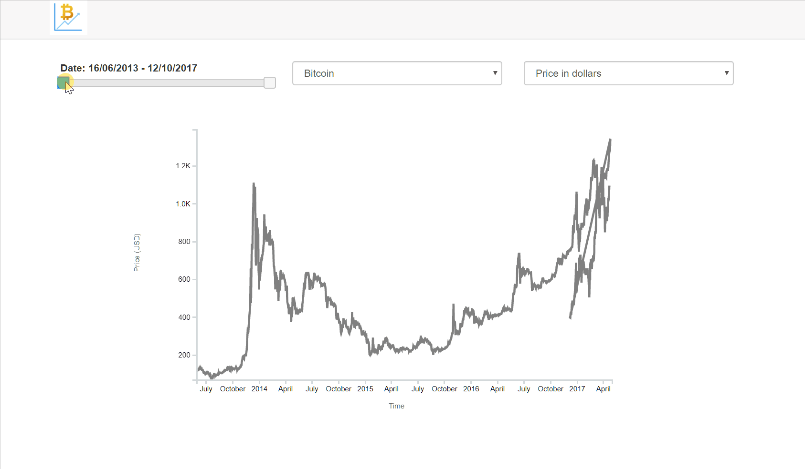

### Interactive cryptocurrency chart

This project is an interactive line chart, showing cryptocurrency data from year 2013 to 2017. Date range, cryptocurrencies and different characteristics (market capitalization, price in USD, 24 hour trading volume) can be selected.

